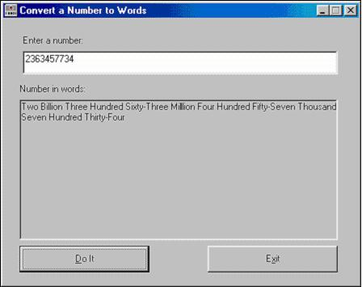



## Number to Words Function

### Description

The NumToWords function will take in a number up to 36 digits long and return a string expressing that number in words. For example, given "123456", the function will return "One Hundred Twenty-Three Thousand Four Hundred Fifty-Six". This download project is a simple interface that allows this function to be tested.

Note:	The "groupings" of numbers, from low to high, are named as follows: Thousand, Million, Billion, Trillion, Quadrillion, Quintillion, Sextillion, Septillion, Octillion, Nintillion, Decillion.
 
### More Info
 

             |
---                |---
**Submitted On**   |1999-04-07 16:14:26
**By**             |[TheVBPro](https://github.com/Planet-Source-Code/PSCIndex/blob/master/ByAuthor/thevbpro.md)
**Level**          |Intermediate
**User Rating**    |5.0 (10 globes from 2 users)
**Compatibility**  |VB 6\.0
**Category**       |[String Manipulation](https://github.com/Planet-Source-Code/PSCIndex/blob/master/ByCategory/string-manipulation__1-5.md)
**World**          |[Visual Basic](https://github.com/Planet-Source-Code/PSCIndex/blob/master/ByWorld/visual-basic.md)
**Archive File**   |[Number\_to\_2020849192006\.zip](https://github.com/Planet-Source-Code/thevbpro-number-to-words-function__1-66606/archive/master.zip)

